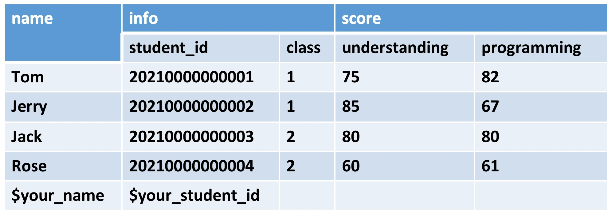
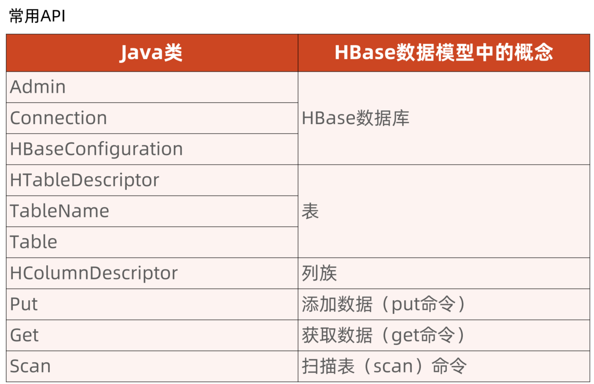
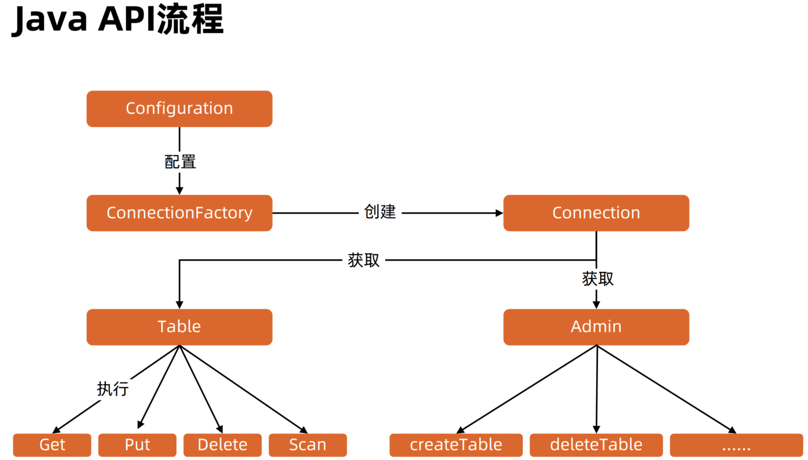

## 0725 课后作业

### 题目
编程实践，使用 Java API 操作 HBase
主要实践建表、插入数据、删除数据、查询等功能。要求建立一个如下所示的表：

* 表名：$your_name:student
* 空白处自行填写, 姓名学号一律填写真实姓名和学号



* 服务器版本为 2.1.0（hbase 版本和服务器上的版本可以不一致，但尽量保证一致）
```sh
<dependency>
    <groupId>org.apache.hbase</groupId>
    <artifactId>hbase-client</artifactId>
    <version>2.1.0</version>
</dependency>

```

### 解题思路



代码: 
测试: 
结果:
namespace：


scan table 结果：


参考文档:
[1] [Insert Data Into HBase Table Using Java API](https://www.corejavaguru.com/bigdata/hbase-tutorial/hbase-java-client-api-examples)
[2] [HBase 系列（六）——HBase Java API 的基本使用](https://juejin.cn/post/6844903949732937735)